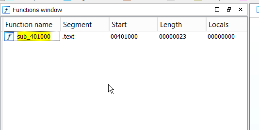

# Furikuri Tutorial

## Minimal Usage
Defined in `furikuri_console` project

    furikuri fuku;
        shibari_module _module(
            std::string("..\\..\\app for test\\vm_test.vmp.exe")
        );
    
    
        if (fuku.set_main_module(&_module)) {
    
            std::vector<uint8_t> out_image;
    
            fuku_settings_obfuscation ob_set(2, 2, 40.f, 40.f, 40.f,
                FUKU_ASM_SHORT_CFG_USE_EAX_SHORT | FUKU_ASM_SHORT_CFG_USE_DISP_SHORT | FUKU_ASM_SHORT_CFG_USE_IMM_SHORT);
    
    
            fuku.add_ob_code_list({ 0x16915 , 0x29 }, &_module, ob_set);
    
            if (fuku.fuku_protect(out_image)) {
    
                FILE* hTargetFile;
                fopen_s(&hTargetFile, "..\\..\\app for test\\fuku_test.exe", "wb");
    
                if (hTargetFile) {
                    fwrite(out_image.data(), out_image.size(), 1, hTargetFile);
                    fclose(hTargetFile);
    
                    printf("fuku_protect good !\n");
                }
            }
            else {
                printf("fuku_protect error !\n");
            }
        }

## How to find `fuku_protected_region` (RVA/Size)

    struct fuku_protected_region {
        uint32_t region_rva;
        uint32_t region_size;
    };

Protecting

    fuku.add_ob_code_list({ 0x1000 , 0x20 }, &_module, ob_set); // 1st parameter fuku_protected_region

 - `0x1000` hex value of RVA
 -  `0x23` hex value of region size

Where find this values? In `Ida Pro` for example.

Start represent `RVA`.
Length represent `Size`.

## Obfuscation

      fuku_settings_obfuscation ob_set(3, 3, 40.f, 40.f, 40.f,
                FUKU_ASM_SHORT_CFG_USE_EAX_SHORT |
                FUKU_ASM_SHORT_CFG_USE_DISP_SHORT |
                FUKU_ASM_SHORT_CFG_USE_IMM_SHORT);
Parameters info

    class fuku_settings_obfuscation {
        unsigned int complexity;        //number of passes for single line
        unsigned int number_of_passes;  //number of passes for full code
        float junk_chance;   //0.f - 100.f chance of adding junk
        float block_chance;  //0.f - 100.f chance of generation new code graph
        float mutate_chance; //0.f - 100.f chance of mutation line
        uint8_t asm_cfg; //assambler builder flags
